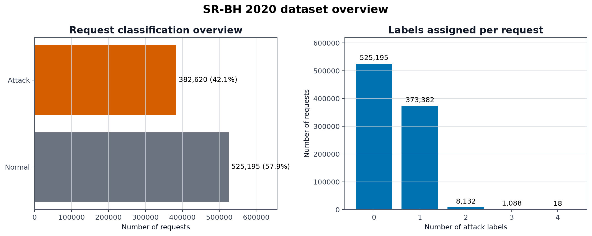
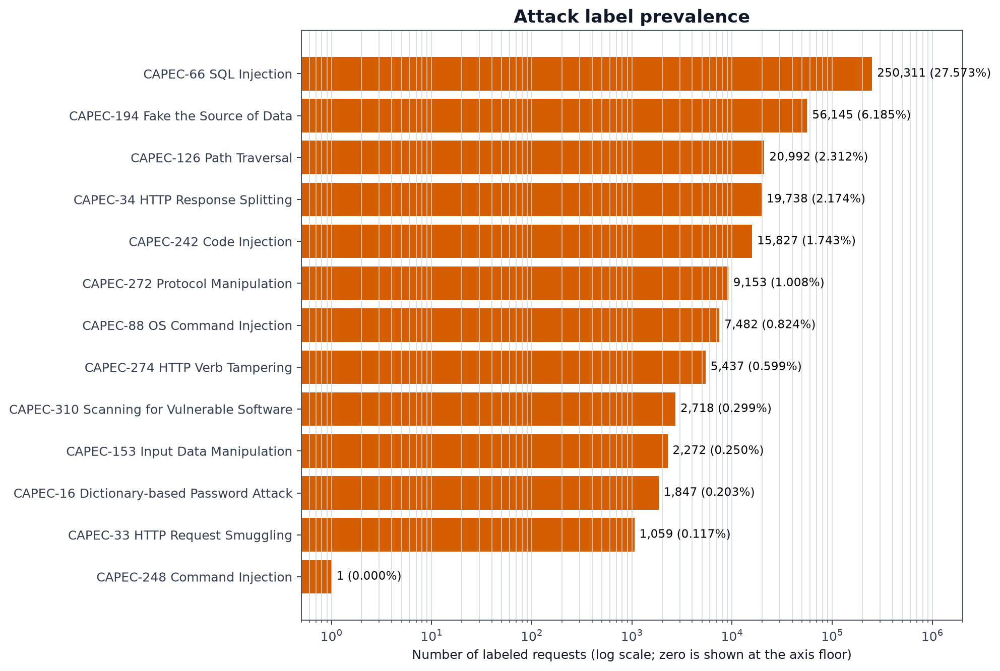
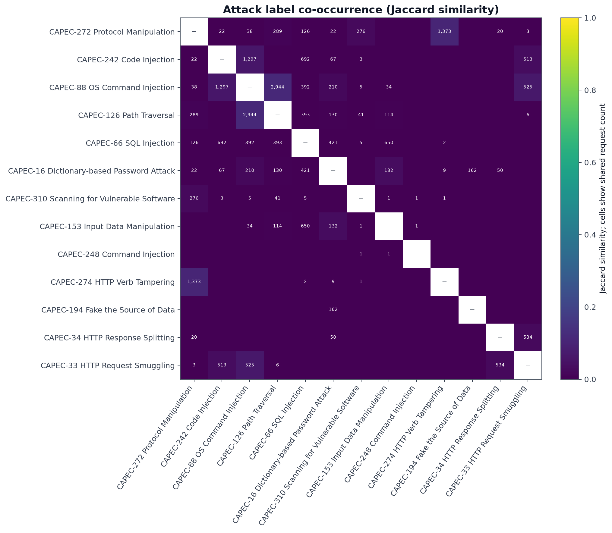
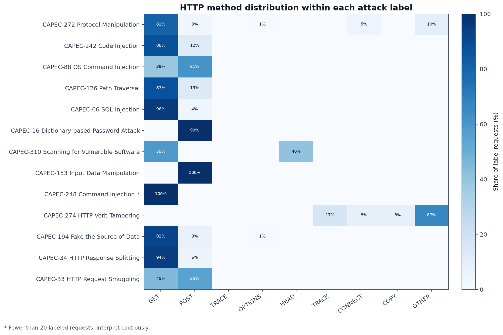
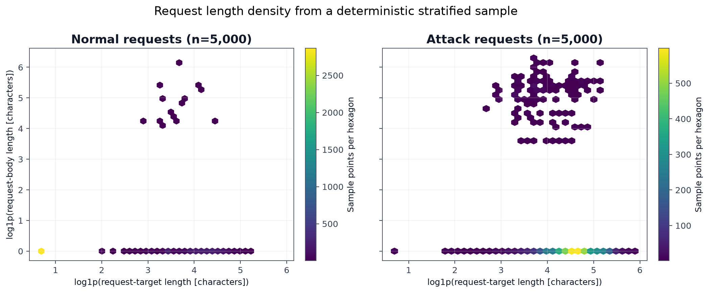
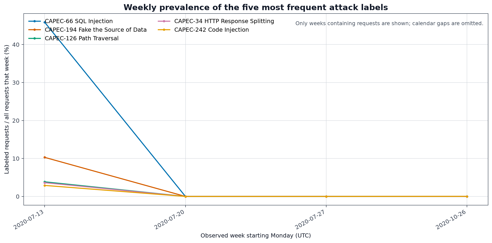

# SR-BH 2020 Security Attack Profile

This report is generated from aggregate statistics over **907,815 HTTP requests**.
It contains no raw URLs, IP addresses, cookies, headers, user agents, or request bodies.

## Key observations

- **382,620 requests (42.1%)** have at least one configured attack label; the remaining **525,195** are treated as normal.
- The most frequent label is **CAPEC-66 SQL Injection**, with **250,311 requests (27.6%)**.
- **9,238 requests** have more than one attack label, so co-occurrence must be considered during evaluation.
- Labels below 20 observations are marked as insufficient support. Current low-support labels: **CAPEC-248 Command Injection (1 request)**.
- Configured attack labels are strongly concentrated in the earliest observed collection week (2020-07-13). Treat the timeline as evidence of collection or campaign shift, not a general population trend.

## Reproduce the report

From the repository root, install the project dependencies and run:

```powershell
py -m pip install -r requirements.txt
http-attack-visualize --dataset-config configs/dataset.srbh2020.yaml --output reports/dataset-profile
```

The CSV is processed in chunks. The request-length figure uses a deterministic, stratified sample so repeated runs with the same seed produce the same sample.

## Figures

### 1. Dataset overview



### 2. Attack label prevalence



### 3. Label co-occurrence



### 4. HTTP method by attack



### 5. Request length distribution



### 6. Attack timeline



## Interpretation limits

- Normal means that every configured attack target is zero; it is not an independent model prediction.
- Label counts overlap because this is a multi-label dataset. Percentages across labels therefore do not sum to 100%.
- Very small classes cannot support reliable comparisons. In particular, any label with fewer than 20 observations should be treated as descriptive only.
- SR-BH labels originated from ModSecurity/OWASP CRS signals and were subsequently reviewed manually and semi-automatically. They are not fully rule-independent human ground truth.
- The length-density plot describes a deterministic sample. All other figures use aggregate statistics from the complete dataset.
- The timeline reports weekly prevalence rather than raw volume, reducing distortion from changes in total traffic.
